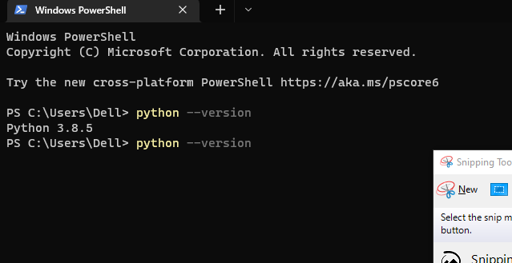

### Day 1: 30 Days of python programming
## Exercise: Level 1
# Question 1
# python --version  'Python 3.8.5'

![][]

# Question 2 
1. print(3+4)
2. print(4-3)
3. print(4%3)
4. print(3*4)
5. print(4/3)
6. print(4//3)
7. print(4**3)

# Question 3
1. print("ISHAQ")
2. print("HASSAN")
3. print("NIGERIA")
4. print("I am enjoying 30 days of python")

# Question 4
1. print(type(10)) 
2. print(type(9.8)) 
3. print(type(3.14)) 
4. print(type(4-4j)) 
5. print(type(['Asabeneh', 'Python', 'Finland'])) 
6. print(type("ISHAQ"))
7. print(type("HASSAN"))
8. print(type("NIGERIA"))

## Exercise 3
# Quetion 1
1. 122 "int"
2. 12.12 "float"
3. 2-2j "complex"
4. "This is a String"
5. ["abba","bala","momi"] "list"
6. ("abba","bala","momi") "tuple"
7. {"firstName":"abba","lastName":"bala"} " Dict"
8. {1,2, 3, 4, 5} "set"
9. True or False " 1==1 0r 1==2" "boolean"

#Question 3
print(((10-2)+(8-3)) * 0.5)