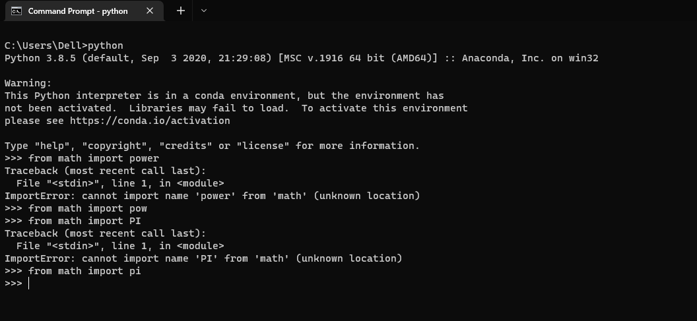

### Day 15: 30 Days of python programming
### Topic: Python Type Errors
1. AttributeError

2. ImportError.PNG

3. IndexError
[Alt text](IndexError.PNG)

4. KeyError

5. ModuleNotFoundError

6. NameError

7. SyntaxError

8. TypeError

9. ValueError

10. ZeroDivisionError
